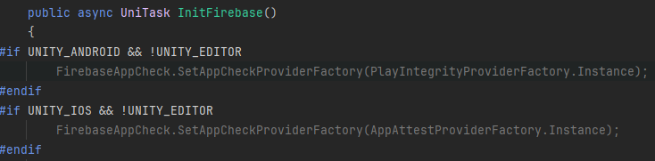

# Intergrate Firebase AppCheck

> [!IMPORTANT]
> Firebase AppCheck is REQUIRED to verify authorized game client to access our services

## Step 1: Import Firebase AppCheck into your project
Follow https://firebase.google.com/docs/app-check/unity/default-providers to setup Firebase Appcheck in your project

## Step 2: Get AppCheckToken then Set to SDK

Set appCheck proviver when init

Get appCheck token and set to ThetanSDKManager

## Step 3: Active AppCheck in Firebase
Go to Firebase -> AppCheck: https://console.firebase.google.com/project/your-project-id/appcheck 
#### Setting Android with Play Intergrity

#### Setting iOS with App Attest

## Step 4: Create Service Account and Send to us
Go to GCP Service Account: https://console.cloud.google.com/iam-admin/serviceaccounts?project=your-project-id

#### Create service account with name: thetanworld-sdk-appcheck

#### Grant role: Firebase App Check Token Verifier

### Create key and send to us

Finally send us that key, thanks so much!